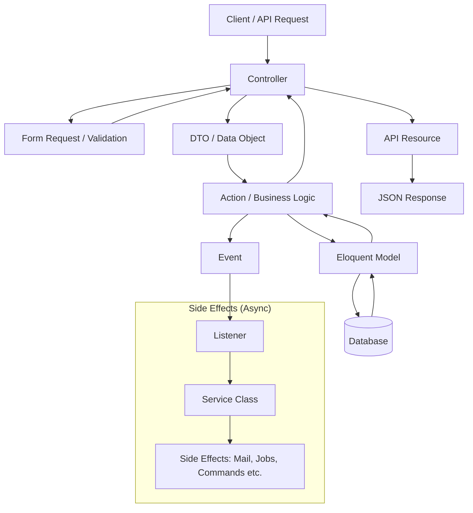

# API Boilerplate

A Rest API backend development boilerplate using Laravel framework.

## Features Included

- JWT token based Authentication using [Laravel Sanctum](https://laravel.com/docs/12.x/sanctum).
- API Documentation using [Scramble](https://scramble.dedoc.co/).
- CRUD Generation Helper using Action/Command Pattern
  using [action-crud-helper](https://packagist.org/packages/kamrul-haque/action-crud-helper).
- Dynamic Role based Access Control (RBAC) System.
- Efficient PHP Backed Enum Handling using Cast & Trait.
- Auto Created by User Log using Trait and Database Table.
- Global Data Time Format and Timezone Conversion using Cast & Service Class (Facade Pattern).
- Auto Slug Generation using Trait
- Duration calculation from Datetime or Timestamps using Trait
- Custom Format Unique ID generation using Service Class
- Realtime Route Prefix Lists using Service Class

## Project Setup

- clone the repository in your local machine:

```
git clone https://github.com/Kamrul-Haque/api-boilerplate.git
```

- install PHP dependencies via [composer](https://getcomposer.org/):

```
composer install
```

- copy .env.example file and create a new .env file using the terminal:

```
cp .env.example .env
```

- generate an application key:

```
php artisan key:generate
```

- set project configurations in `.env` file.
- create a MySQL database named `pr_school` or change the name in `.env` later.
- create tables in the database and seed default data:

```
php artisan migrate --seed
```

- use [Herd](https://herd.laravel.com/windows), [Valet](https://laravel.com/docs/12.x/valet) etc. or `php artisan serve`
  command to use run the application in localhost.

*Note: the above steps are for running the application in local environment.*

## Project Structure

```text
pr-sms-backend/
├── app/
│   ├── Actions/         # Business logic implementing the Command pattern
│   │   ├── Api/         # API-specific business actions
│   │   └── Web/         # Web-specific business actions (suggested)
│   ├── Casts/           # Custom Eloquent attribute casting
│   ├── DTOs/            # Data Transfer Objects for type-safe requests
│   │   ├── Api/         # API-specific DTOs (suggested)
│   │   └── Web/         # Web-specific DTOs (suggested)
│   ├── Enums/           # PHP backed enums for status, roles, etc.
│   ├── Events/          # Application event classes
│   ├── Exceptions/      # Custom exception classes
│   ├── Http/            # HTTP layer handling requests and responses
│   │   ├── Controllers/ # HTTP Controllers
│   │   │   ├── Api/     # API controllers
│   │   │   └── Web/     # Web controllers
│   │   ├── Middleware/  # HTTP Middleware
│   │   ├── Requests/    # Form requests (validation rules)
│   │   │   ├── Api/     # API request validation
│   │   │   └── Web/     # Web request validation (suggested)
│   │   └── Resources/   # API Resources for JSON serialization
│   ├── Imports/         # Excel/CSV import logic
│   ├── Jobs/            # Queued jobs for async processing
│   ├── Listeners/       # Event listeners
│   ├── Mail/            # Mailable classes
│   ├── Models/          # Eloquent models
│   ├── Notifications/   # Notification classes (Email, Database, etc.)
│   ├── Providers/       # Service providers
│   ├── Rules/           # Custom validation rules
│   ├── Services/        # Reusable business logic and integrations
│   └── Traits/          # Reusable traits for models and classes
├── bootstrap/           # Framework bootstrapping and exception handling
├── config/              # Application configuration files
├── database/
│   ├── factories/       # Model factories for testing data
│   ├── migrations/      # Database schema migrations
│   └── seeders/         # Database seeders
├── docs/                # Technical documentation and feature specifications
├── lang/                # Localization files (en, ja)
├── public/              # Web server root and static assets
├── resources/
│   ├── css/             # Stylesheets (Tailwind)
│   ├── js/              # JavaScript files
│   └── views/           # Blade templates (mail, layouts)
├── routes/              # Application route definitions
├── storage/             # Logs, compiled views, and file storage
├── stubs/               # Custom code generation stubs
├── tests/
│   ├── Feature/         # Feature tests (HTTP requests, database)
│   │   ├── Api/         # API endpoints tests
│   │   └── Web/         # Web endpoints tests (suggested)
│   └── Unit/            # Unit tests (isolated logic)
└── vendor/              # Composer dependencies
```

## Architecture & Design Pattern

The project follows a layered architecture implementing the **Action + DTO Pattern**, combined with an
**Event-Listener-Service Pattern** for handling side effects.



## Developer Workflow

This project follows a structured approach using the **Action + DTO pattern**. To implement a new feature around
a model (e.g., `Category`), follow these steps:

### 1. Create Model, Migration, Factory and Seeder

Generate the model along with its migration, factory and seeder.

```bash
php artisan make:model Category -mfs
```

Add necessary traits in the model (e.g., `Trashable`, `HasSlug`, `HasCreatedBy`) if needed.

### 2. Create API Request & Resource

Generate a Form Request for validation and an API Resource for response formatting.

```bash
php artisan make:request StoreCategoryRequest
php artisan make:resource CategoryResource
```

### 3. Define DTO (Data Transfer Object)

Create a new DTO in `app/DTOs/CategoryData.php` to handle structured data.

```bash
php artisan make:class DTOs/CategoryData
```

Implement the `fromRequest` method in the DTO to map validated request data.

### 4. Create Action

Create an action class in `app/Actions/Api/CategoryActions/CreateCategoryAction.php` to handle business logic.

```bash
php artisan make:action Api/CategoryActions/CreateCategoryAction
```

Actions must extend `BaseAction` and implement the `handle()` method.

### 5. Create Controller

Generate an API controller in `app/Http/Controllers/Api/CategoryController.php` and inject the Action class.

```bash
php artisan make:controller Api/CategoryController --api --model=Category
```

### 6. Create Event (if needed)

Create event for handling side effects like sending email, notifying user, dispatching queued jobs etc.

```bash
php artisan make:event CreateCategoryEvent
```

### 7. Register Routes

Add the routes in `routes/api.php`.

### 8. Write Tests

Create feature tests using Pest to verify the implementation.

```bash
php artisan make:test Api/CategoryTest
```
